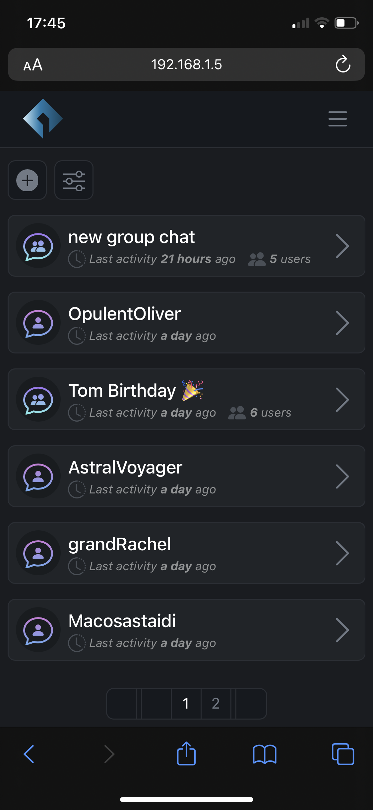
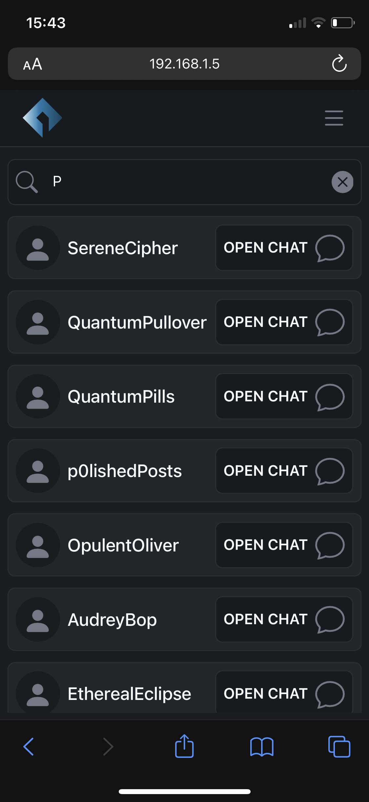
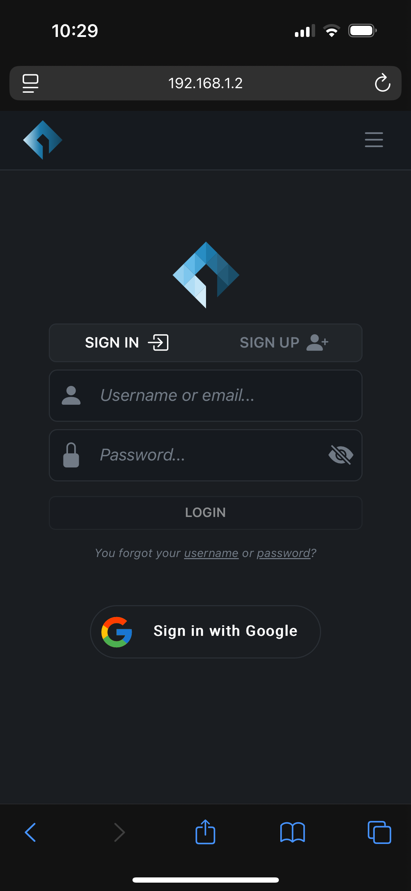
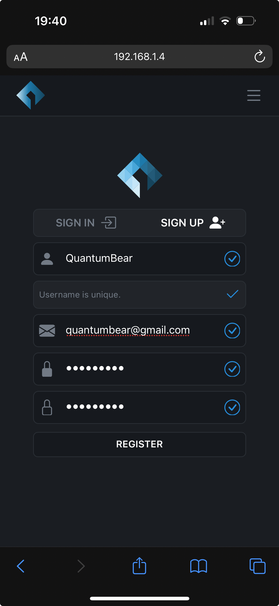

<div align="center">


<h1>Nyla</h1>
<p>Nyla is an example of an instant messaging application.</p>
<div align="center">		

</div>
<br>
	<div align="center">
		
		
		
		
		
	</div>
</div>

<br>

# Requirements
- <a href="https://www.mongodb.com">MongoDB</a>
- <a href="https://expressjs.com/">Express.js</a>
- <a href="https://reactjs.org/">React.js</a>
- <a href="https://nodejs.org/en/">Node.js</a>
- <a href="https://redis.com">Redis</a>

<br>

# Architecture
Nyla is a centralized instant messaging application built with React.js front-end, Express.js back-end and MongoDB database. Real-time messaging is provided by Websockets as notification servers, coordinated using Redis message queue. The chosen architecture and overall server design allows for  horizontally scalability.
<div align="center"></div>
<br>

This repository contains the implementation of the web server (client folder), REST api server (<b>server-api</b> folder) and ws server (<b>server-ws</b> folder). MongoDB and Redis can be used simply by installing the relevant software; no other configuration (other than that provided in the folders listed above) is required.

<br>


# Getting started (local development build)
To start with the local development build (each server in single instance), <b>docker-compose</b> can be used ( manual configuration is also described below).

<br>

## Using docker-compose (recommended)
1. Start <b>Docker</b> application
1. Navigate to the project root folder (where docker-compose.yaml file is located) and just run all the services using docker-compose:
   
			docker-compose up
Wait for container creations, once client development server is ready, connect to the app using your browser.

<br>

## Manual Setup
Setup <b>back-end</b> (<i>MongoDB</i>, <i>Redis</i>, <i>REST-API server</i> and <i>WS server</i>) and <b>front-end </b>(<i>React Client App</i>) of the app by following the list below.<br><br>
<b>Configurations files are already set for local development build.</b>

### MongoDB
At first, the app will start with an empty database, generated with the first write (probably a user registration). For this reason database configuration only consist in starting the MongoDB process or service.
1. Download and setup MongoDB (<a href="https://www.mongodb.com/try/download/community">here</a>). 
2. Start MongoDB as process or a service.
<br>

### Redis
1. Redis is used as message-queue for <i>API server</i> and <i>WS server</i> communication. Just download and configure Redis in the build environment (<a href="https://redis.io/download/">here</a>).
2. Start Redis server:

        % redis-server

### REST-API Server (Express.js)
1. In <b>server-api</b> <a href="https://github.com/francescocartelli/nyla-instant-messaging-app/tree/master/server-api/.env">.env</a> file provide the basic configurations:
   - Provide database url and name: 
  
       		DATABASE_URL=mongodb://<database_host:database_port>
			DATABASE_NAME=<your_database>
   - Provide authentication random encryption key (better if its very long and complex) for password hashing:
  
        	SECRET_OR_KEY=<your_secret_or_key>
  
   - Provide Redis MQ url and port:
  
        	MQ_SERVER_URL=<redis_server_host:redis_server_port>
2. From the <b>server-api</b> root folder, install all required modules, then run the server:
   
    	  server % npm install
		  server % npm start

### WS-Server (WS.js)
1. In <b>server-ws</b> <a href="https://github.com/francescocartelli/nyla-instant-messaging-app/tree/master/<b>server-ws</b>/.env">.env</a> file provide the basic configurations:
   - Provide Redis MQ url and port configurations:

			MQ_SERVER_URL=<redis_server_host:redis_server_port>

	- Provide <b>server-api</b> url:

			API_SERVER_URL=<api_server_host:api_server_port>

2. From the <b>server-ws</b> root folder, install all required modules, then run the server:
 
   		  server % npm install
		  server % npm start

### Static Web Server (React.js)
1. In <b>client</b> <a href="https://github.com/francescocartelli/nyla-instant-messaging-app/tree/master/client/.env">.env</a> file provide the basic configurations:
   - Provide url for react-proxy server (to <b>server-api</b>):
   
		  REACT_APP_PROXY_URL=http://localhost:3001
   - Provide the url for ws-server:
   
		  REACT_APP_WSS_URL=ws://<ws_server_host:ws_server_port>

2. From the <b>client</b> root folder, install the packages, then run the client:

		  client % npm install
		  client % npm start
<br><br>

# Open-API Swagger Documentation
The API documentation is generated using Swagger, and it provides a comprehensive overview of all available endpoints, their functionality, required parameters, and expected responses. You can access the Swagger documentation by visiting http://localhost:3001/api-docs after starting the API server.

<br><br>

# Folder Structure
```
.
├── client
|   ├── public
|   └── src
|       ├── api
|       ├── components
|       |   ├── Alerts
|       |   ├── Common
|       |   ├── Icons
|       |   ├── Pages
|       |   |   ├── Account
|       |   |   ├── Chats
|       |   |   ├── Home
|       |   |   └── Users
|       |   ├── UI
|       |   |   ├── Footer
|       |   |   ├── Nav
|       |   |   └── Push
|       |   └── Ws
|       ├── styles
|       └── utils
|
├── images
|
├── server-api
|   ├── components
|   ├── controllers
|   ├── middleware
|   ├── schemas
|   |   └── abstract
|   └── services
|
└── server-ws
    └── services
```

<br><br>

# Main Features (Images)
### Create and track your personal chats
Create and track your personal chats and find new users.<br>



### Instant messaging with group and direct chats
Instant messaging with group and direct chats with intuitive settings.<br>
  
  

### Fast password-based registration/authentication
Registration/authentication using username and password.<br>
  
  

<br><br>

# Curiosity
Nyla is a short word inspired by <i>Nyarlathotep</i>, who is a fictional entity belonging to Howard Phillips Lovecraft's <i>Cthulhu Cycle</i>. Nyarlathotep acts according to the will of the Outer Gods and is their messenger.

<br><br>

# Author
- <a href="https://github.com/francescocartelli">Francesco Cartelli</a>

<br><br>

# License
This project is licensed under the MIT License, which means you're free to use, modify, and distribute the code as long as you include the original license notice.